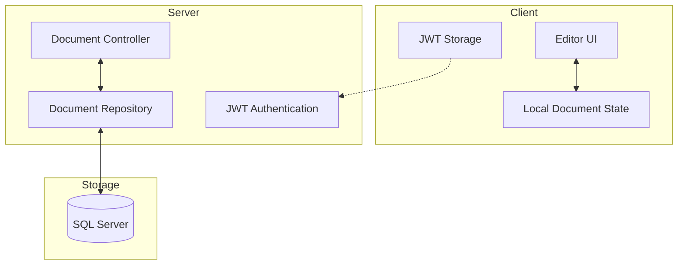
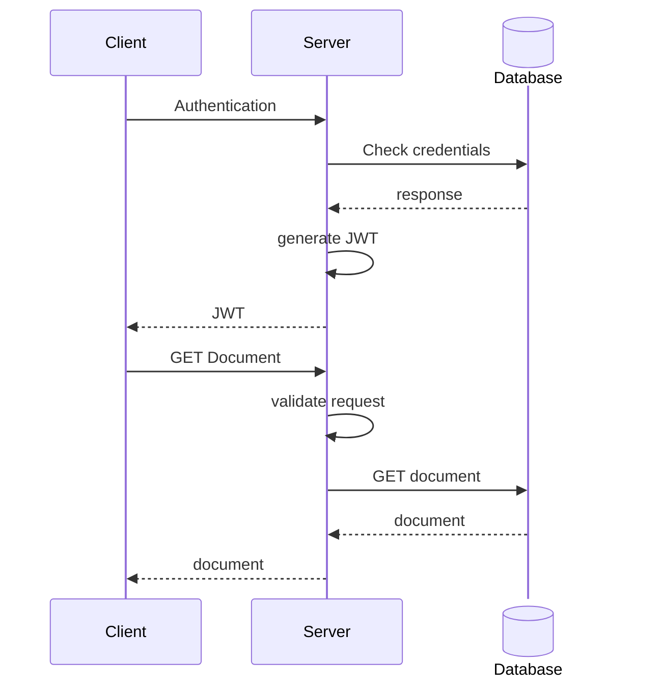
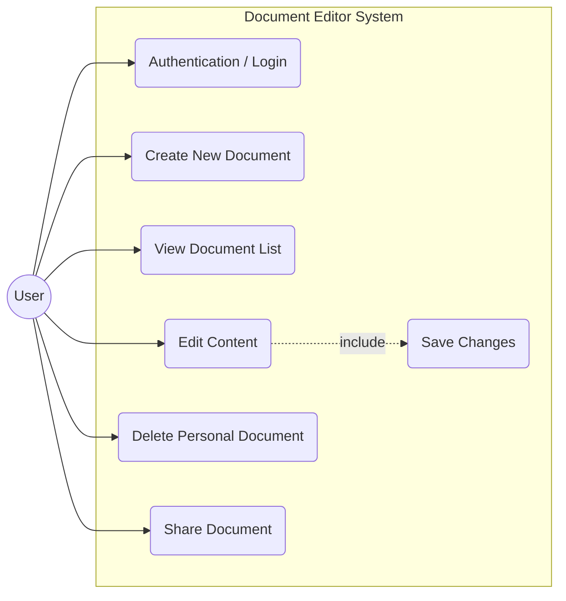
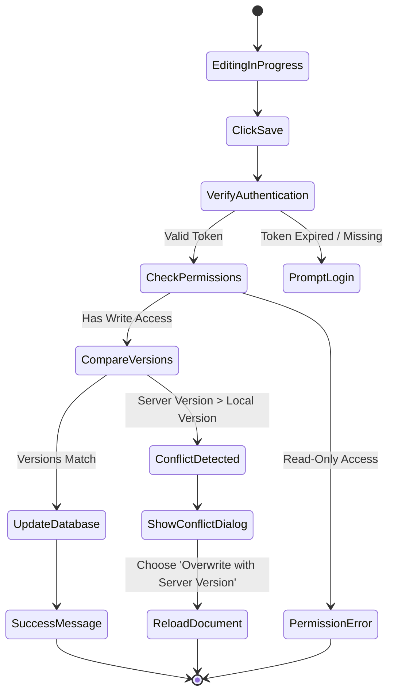

# Arhitectura

---

## Diagrame UML

### Diagrama de secventa autentificare 

---

### Diagrama caz utilizari

---

### Diagrama activitate -> salvare document 

vezi  [Baza de date](Database.md)
vezi  [Backend](Backend.md)
