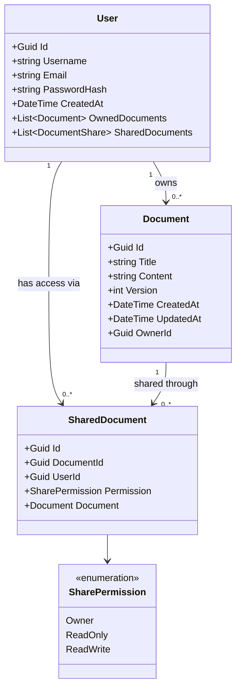

# Modelele

---

# Endpoint-urile

### Auth
##### POST /auth/register
Inregistreaza un utilizator nou cu username, email si parola stocata cu hash().
- `201 Created` → utilizatorul creat
- `400 Bad Request` → date invalide (email lipsa, parola prea scurta etc.)
- `409 Conflict` → email-ul sau username-ul exista deja

##### POST /auth/login
Autentifica utilizatorul si returneaza un JWT token.
- `200 OK` → JWT token
- `400 Bad Request` → date invalide
- `401 Unauthorized` → credentiale gresite

---
### Shared Documents
##### GET /shared-docs
Returneaza lista tuturor shared documents ale utilizatorului autentificat (titlu + shareId + permisiune).
- `200 OK` → lista de shared documents
- `401 Unauthorized` → token lipsa / invalid

##### GET /shared-docs/{shareId}
Returneaza un shared document specific cu documentul complet in el.
- `200 OK` → shared document-ul cu documentul
- `401 Unauthorized` → token lipsa / invalid
- `403 Forbidden` → shared document-ul nu apartine userului
- `404 Not Found` → shared document-ul nu exista

##### POST /shared-docs
Creeaza un document nou + shared document de tip Owner automat pentru utilizatorul autentificat.
- `201 Created` → shared document-ul de tip Owner cu documentul creat
- `400 Bad Request` → date invalide (titlu lipsa etc.)
- `401 Unauthorized` → token lipsa / invalid

##### PUT /shared-docs/{shareId}
Actualizeaza continutul documentului din shared document, cu verificare de versiune.
- `200 OK` → shared document-ul actualizat cu documentul nou
- `400 Bad Request` → date invalide
- `401 Unauthorized` → token lipsa / invalid
- `403 Forbidden` → userul are doar ReadOnly
- `404 Not Found` → shared document-ul nu exista
- `409 Conflict` → versiunea clientului e in urma fata de server

##### DELETE /shared-docs/{shareId}
Sterge shared document-ul. Daca userul e Owner, sterge si documentul si toate shared documents asociate.
- `204 No Content` → sters cu succes
- `401 Unauthorized` → token lipsa / invalid
- `403 Forbidden` → shared document-ul nu apartine userului
- `404 Not Found` → shared document-ul nu exista

---
### Partajare
##### GET /shared-docs/{shareId}/shares
Returneaza lista shares ale altor utilizatori pentru documentul din shared document.
- `200 OK` → lista de shares
- `401 Unauthorized` → token lipsa / invalid
- `403 Forbidden` → userul nu e Owner
- `404 Not Found` → shared document-ul nu exista

##### POST /shared-docs/{shareId}/shares
Partajeaza documentul cu un alt utilizator, specificand permisiunea (ReadOnly / ReadWrite).

- `201 Created` → share-ul creat pentru utilizatorul tinta
- `400 Bad Request` → userId lipsa / permisiune invalida
- `401 Unauthorized` → token lipsa / invalid
- `403 Forbidden` → userul nu e Owner
- `404 Not Found` → shared document-ul sau userul tinta nu exista
- `409 Conflict` → documentul e deja partajat cu acel utilizator

##### PUT /shared-docs/{shareId}/shares/{userId}
Modifica permisiunea unui utilizator pentru documentul din shared document.
- `200 OK` → share-ul actualizat
- `400 Bad Request` → permisiune invalida
- `401 Unauthorized` → token lipsa / invalid
- `403 Forbidden` → userul nu e Owner
- `404 Not Found` → share-ul nu exista

##### DELETE /shared-docs/{shareId}/shares/{userId}
Revoca accesul unui utilizator la documentul din shared document.
- `204 No Content` → revocat cu succes
- `401 Unauthorized` → token lipsa / invalid
- `403 Forbidden` → userul nu e Owner
- `404 Not Found` → share-ul nu exista

[Inapoi](Architecture.md)