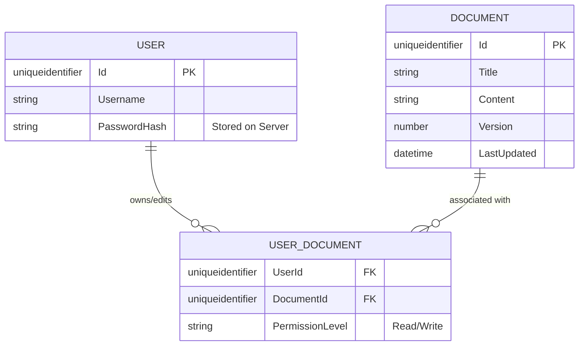

# Diagrama relatie

### Explicatie
USER -> tine doar hash-ul parolei, username-ul si  id-ul

USER_DOCUMENT-> face legatura intre document in sine si user. detine permisiunile sale per document

DOCUMENT-> reprezinta documentul in sine

[[Architecture.md|Inapoi]]